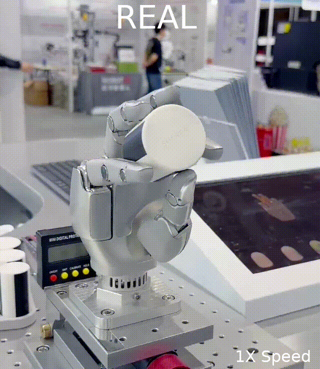

# Overview
This is a repo for reinforcement learning sim2real rotation demo on SharpaWave, provides a step-by-step guide for training, visualizing and deploying.

<p align="center">
  
  
</p>

# 1. Environment Setup
## 1.1. Follow the official  Isaaclab installation guide:
Install [IsaacLab](https://isaac-sim.github.io/IsaacLab/main/source/setup/installation/pip_installation.html). 

Ubuntu 22.04, conda environment, release/2.2.0 and release/2.3.0 have been tested.

CAUTION⚠️: A minimum of 32GB RAM is required. For specific requirements, please refer to [requirements](https://docs.isaacsim.omniverse.nvidia.com/latest/installation/requirements.html).
## 1.2. Install this repo:  
```bash
conda activate env_isaaclab 
cd sharpa_tac_rl 
pip install -e .
```

## 1.3. GPU device order on multi-GPU machines
Isaac Sim/Vulkan and PyTorch may enumerate GPUs in different orders on mixed-GPU machines. For example, Vulkan may show `0/1 = RTX 3090` while PyTorch shows `0/1 = RTX 4090`. This can make rendering and PhysX use different physical GPUs and may cause errors such as `PxgCudaDeviceMemoryAllocator failed`, `no active physics scene found`, or videos being rendered on the wrong GPU.

Set PCI bus ordering before launching Isaac Lab scripts:
```bash
export CUDA_DEVICE_ORDER=PCI_BUS_ID
```

Then select the GPU with `--device cuda:<id>` according to `nvidia-smi` order:
```bash
CUDA_DEVICE_ORDER=PCI_BUS_ID python rl_isaaclab/scripts/play.py \
  --task Isaac-Inhand-Rotate-Sharpa-Wave-v0 \
  --num_envs 16 \
  --algorithm ProprioAdapt \
  --load_path ${pth} \
  --headless \
  --video \
  --device cuda:0
```

Avoid using `CUDA_VISIBLE_DEVICES` to mask GPUs for Isaac Sim rendering unless you have verified that CUDA, Vulkan, and PhysX still agree on the same physical GPU.

# 2. Training
## 2.1. Generate grasp cache
```bash
# CAUTION⚠️: Same object scale config will overwrite the older one.
python rl_isaaclab/scripts/gen_grasp.py --task Isaac-Inhand-Rotate-Grasp-Sharpa-Wave-v0 --headless
```
## 2.2. Train the policy
```bash
python rl_isaaclab/scripts/train.py --task Isaac-Inhand-Rotate-Sharpa-Wave-v0 --headless
```
To save videos during headless training, add `--video`. Use `--video_interval` to shorten the gap between videos:
```bash
CUDA_DEVICE_ORDER=PCI_BUS_ID python rl_isaaclab/scripts/train.py \
  --task Isaac-Inhand-Rotate-Sharpa-Wave-v0 \
  --headless \
  --video \
  --video_length 300 \
  --video_interval 400 \
  --video_resolution=1920,1080 \
  --video_camera_eye=0.35,-0.45,0.82 \
  --video_camera_lookat=-0.095,-0.005,0.62 \
  --device cuda:0
```
## 2.3. Distillation
```bash
# last.pth is recommended if curriculum is enabled
python rl_isaaclab/scripts/train.py --task Isaac-Inhand-Rotate-Sharpa-Wave-v0 --headless --algorithm ProprioAdapt --load_path ${pth}
```

# 3. Visualization
## 3.1. Visualize trained policy
```bash
python rl_isaaclab/scripts/play.py --task Isaac-Inhand-Rotate-Sharpa-Wave-v0 --num_envs 16 --load_path ${pth}
```
Headless video recording:
```bash
CUDA_DEVICE_ORDER=PCI_BUS_ID python rl_isaaclab/scripts/play.py \
  --task Isaac-Inhand-Rotate-Sharpa-Wave-v0 \
  --num_envs 16 \
  --load_path ${pth} \
  --headless \
  --video \
  --video_length 300 \
  --video_resolution=1920,1080 \
  --video_camera_eye=0.35,-0.45,0.82 \
  --video_camera_lookat=-0.095,-0.005,0.62 \
  --device cuda:0
```
## 3.2. Visualize distillated policy
```bash
python rl_isaaclab/scripts/play.py --task Isaac-Inhand-Rotate-Sharpa-Wave-v0 --num_envs 16 --algorithm ProprioAdapt --load_path ${pth}
```

# 4. Deploy
## 4.1. Prepare SharpaWave and object
1. Calibrate SharpaWave through SharpaPilot. 
2. A cylinder with radius of 24mm and height of 60mm via 3D priting is recommended under default configuration.
## 4.2. Deploy on SharpaWave (HostComputer Tactile, Recommended)
### 4.2.1. Configure docker
```bash
# INFOℹ️: Install docker and nvidia-ctk following steps 1-4 in <Steps to Acquire 180 Hz High-Frame-Rate High-Performance Tactile Information>.
cd rl_isaaclab/utils
# Configure docker-compose, substitute ${sharpa-rl-lab} with this repo path.
xhost +local:root
USER_ID=$(id -u) GROUP_ID=$(id -g) docker compose up -d
docker exec -it sharpawave_rl_dev bash
rm -r ~/sharpawave-rl-lab/rl_isaaclab/utils/python/
cp -r ~/sharpa-wave-sdk/python/sharpa/ ~/sharpawave-rl-lab/rl_isaaclab/utils/python/
cd ~/sharpawave-rl-lab/
python3 -m pip install -e .
```
### 4.2.2. Deploy
```bash
# INFOℹ️: Keyboard control is enabled by default. Press 'e' to start, press 'w' to freeze, press 'q' to go home.
python3 rl_isaaclab/scripts/deploy.py --task Isaac-Inhand-Rotate-Deploy-Sharpa-Wave-v0 --hand_side ${0/1} --load_path ${pth}
```
## 4.3. Deploy on SharpaWave (OnBoard Tactile)
### 4.3.1. Configure SharpaWaveSDK (For Deploy)
```bash
# INFOℹ️: Install SharpaWaveSDK following the official user manual. ${SharpaWaveSDK} is the root path of the SDK.
rm -r rl_isaaclab/utils/python
cp -r ${SharpaWaveSDK}/python rl_isaaclab/utils/python
```
### 4.3.2. Deploy
```bash
# INFOℹ️: Keyboard control is enabled by default. Press 'e' to start, press 'w' to freeze, press 'q' to go home.
python rl_isaaclab/scripts/deploy.py --task Isaac-Inhand-Rotate-Deploy-Sharpa-Wave-v0 --enable_on_board --hand_side ${0/1} --load_path ${pth}
```

# 5. Configure your own task via modifying the config file
Please refer to rl_isaaclab/tasks/inhand_rotate/sharpa_wave_env_cfg.py and rl_isaaclab/tasks/inhand_rotate/sharpa_wave_deploy_env_cfg.py for details.
